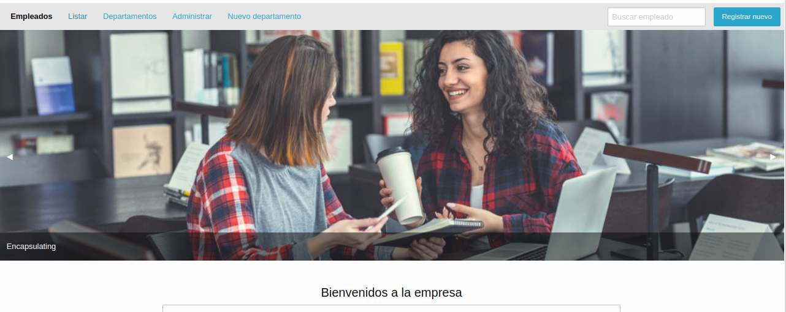
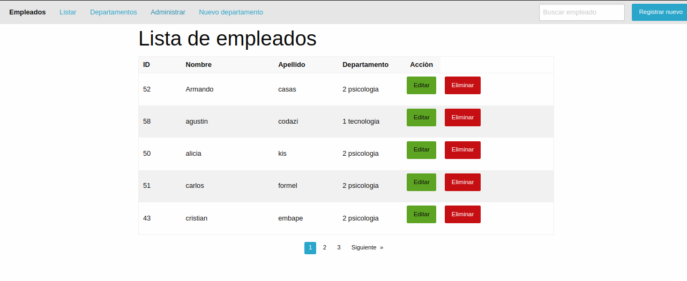

# Django user manager

The project aims to expose the ability to handle relevant topics in Django such as generic classes, use of multimedia files, templet management. Also involve good development practices trying to have a clean and scalable code.

Being a django project, the typical architecture of the MVT framework is used, using layers, presentation, logic and data access.

## Files included

| File                                                             | Details                                                                    |
| ---------------------------------------------------------------- | -------------------------------------------------------------------------- |
| [aplications](aplications)                                       | contains 2 applications, department and employees                          |
| [employee](employee)                                             | contains the project configuration files                                   |
| [media](media)                                                   | this one has the directories with the multimedia files of the applications |
| [static](static)                                                 | directories of the static files as img, js, css                            |
| [templates/base.html](templates/base.html)                       | contains the base html code that is inherited by all templates.            |
| [templates/index.html](templates/index.html)                     | contains the html code of the welcome page of the application              |
| [templates/includes/header.html](templates/includes/header.html) | contains optional files, which may or may not be required to be inherited  |

sample view

\*\* to run the project, at the level of manager.py

- Python3 manage.py runserver

Athor:
Daniel ruiz
[Linkedin](www.linkedin.com/in/daniel-ruiz)
